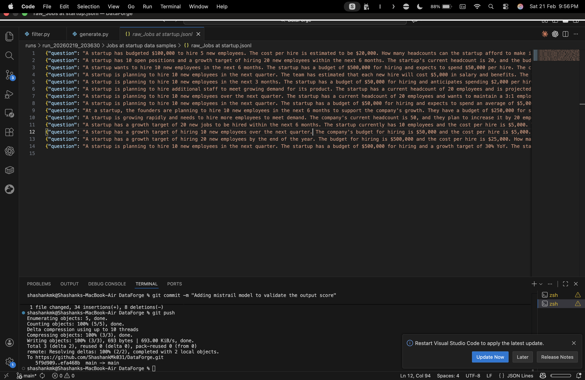

# DataForge

Generate, filter, and score domain-specific math word problems using a local LLM (Ollama by default).

## What this project does
- **Generate**: Creates JSONL samples per domain with strict, structured reasoning.
- **Filter**: Applies rule-based, consistency, quality, and domain-specific checks.
- **Score**: Uses a model-as-judge to score quality and keep samples above a threshold.

## Quick start (local, Ollama)
1) Ensure Ollama is installed and the model is pulled:
```bash
ollama pull llama2
```

2) Run the full pipeline manually:
```bash
# Generate
python generate.py --interactive --ask-samples

# Filter latest run
python filter.py --input latest

# Score latest run
python score.py --input latest --threshold 6.0
```

This will:
- Generate raw samples under `runs/run_<timestamp>/<domain> data samples/raw_<domain>.jsonl`
- Filter them into `filtered_<domain>.jsonl`
- Score them into `final_<domain>.jsonl`

## Project structure
- `generate.py`: Generates raw samples (strict JSON, reasoning steps with equations).
- `filter.py`: Filters samples using rules/consistency/quality/domain checks.
- `score.py`: Scores samples with a local LLM judge.
- `local_llm.py`: Local LLM adapter (Ollama CLI by default).
 (run_pipeline.sh removed): pipeline now runs via individual commands.
- `runs/`: Output runs grouped by timestamp.
- `docs/assets/image.png`: Example snapshot of generated samples.

## Sample format (JSONL)

## Sample preview



Each line is a JSON object with:
- `question`: problem text
- `reasoning`: array of step strings, each containing `=`
- `answer`: final numeric answer with units (string)
- `difficulty`: easy | medium | hard
- `domain`: domain name
- `num_steps`: integer

## How generation works
- Multiple prompt templates (detailed/conversational/minimal).
- Strict JSON enforcement + validation in `generate.py`.
- Per-domain notes can be injected to steer generation.

## Scoring (judge model)
- Default judge: the same local model used for generation.
- Optional override:
```bash
python score.py --input <filtered.jsonl> --output <final.jsonl> --judge-model ollama://mistral
```
This is optional and not required for this machine.

## Useful commands
Generate (custom domains via prompt):
```bash
python generate.py --interactive --ask-samples
```

Generate (custom domains via CLI):
```bash
python generate.py --domains "Jobs at startup" --domain-notes "budget, headcount, runway" --samples-per-domain 15
```

Filter latest run:
```bash
python filter.py --input latest
```

Score latest run:
```bash
python score.py --input latest --threshold 6.0
```

## Notes
- Ollama CLI does not support `--prompt`, `--max-tokens`, `--temperature`, or `--top-p` flags. Configure model behavior through Modelfile or the Ollama API instead.
- If generation is slow, export a higher timeout:
```bash
export OLLAMA_TIMEOUT=120
```

## Why / Where / Limits
**Why**: fast bootstrapping of structured reasoning data when real datasets are scarce.  
**Where it’s useful**: tutoring data, eval sets, fine‑tuning seed data, domain‑specific math datasets.  
**Setbacks**: local LLM quality, strict JSON fragility, and low retention for non‑math domains.  
**What fails**: domains that can’t be expressed as equation‑based steps, or models that produce invalid JSON consistently.  
**Why llama**: local, private, easy to run on macOS with Ollama.  
**API keys?**: supported by swapping the LLM adapter; higher quality at higher cost and lower privacy.  
**Trust**: synthetic data must be validated; use filters + scoring + optional human audit before training.

## Next improvements
- Separate judge model to reduce self‑bias.
- Human audit exports and feedback loop.
- Domain‑specific prompts and validators.

## Pipeline (text)
Generate → Filter → Score → (Optional Human Audit)
